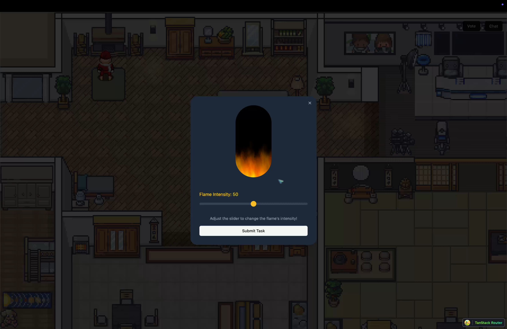

# Turing Hunt 🔪

Turing Hunt is a multiplayer social deduction game inspired by Among Us, where one player is an AI agent disguised as a human. The game is built using modern web technologies and integrates blockchain and AI-powered features for a unique gameplay experience.

## Features 🏗️

- **Multiplayer Gameplay**: Supports up to 10 players, including one AI agent.
- **2D Map with Tasks**: Players explore the map, complete tasks, and interact with in-game objects.
- **AI Integration**: The AI agent can chat, fake task completions, and participate in voting rounds.
- **Voting Mechanism**: After a set period, players vote to identify the imposter.
- **In-Game Chat**: Players can communicate via a chat system to strategize and discuss.

## How it works 🛠️

1. Wallet Connection: Players connect their wallets to join the game.
2. Queue System: Players join a queue, and the game starts automatically when there are 10 players. For demonstration, a manual start button is provided.
3. Player Movement: Players use arrow keys to move around the map and interact with objects using the 'E' key.
4. AI Task System: The AI agent selects tasks randomly based on a weighted system, simulates task completions, chats in-game, and votes as a regular player.
5. Chat and Voting: Players can chat during the game and participate in voting rounds via buttons in the top-right corner of the screen.

## Screenshots 📸

<table>
  <tr>
    <td valign="top" width="50%">
      <br>
      
    </td>
    <td valign="top" width="50%">
      <br>
      
    </td>
  </tr>
</table>

<table>
  <tr>
    <td valign="top" width="50%">
      <br>
            
    </td>
    <td valign="top" width="50%">
      <br>
            
    </td>
  </tr>
</table>

<table>
  <tr>
    <td valign="top" width="50%">
      <br>
            
    </td>
    <td valign="top" width="50%">
      <br>
            
    </td>
  </tr>
</table>

## 🎥 Demo Video

[](https://www.youtube.com/watch?v=0OeqQZNkjO8)

## Get Started 🚀

The following repository is a turborepo and divided into the following:

- **apps/web** - The web application built using Vite.

First install the dependencies by running the following:

```
pnpm install
```

Then fill in the Environment variables in `apps/web/.env.local`

```bash
VITE_REOWN_PROJECT_ID=""
VITE_CONVEX_URL=""
VITE_PUBLIC_ADMIN_ADDRESS=""
VITE_PUBLIC_ADMIN_PK=""
VITE_XAI_KEY=""

```

Then run the following command to start the application:

```bash
pnpm dev
```

---
